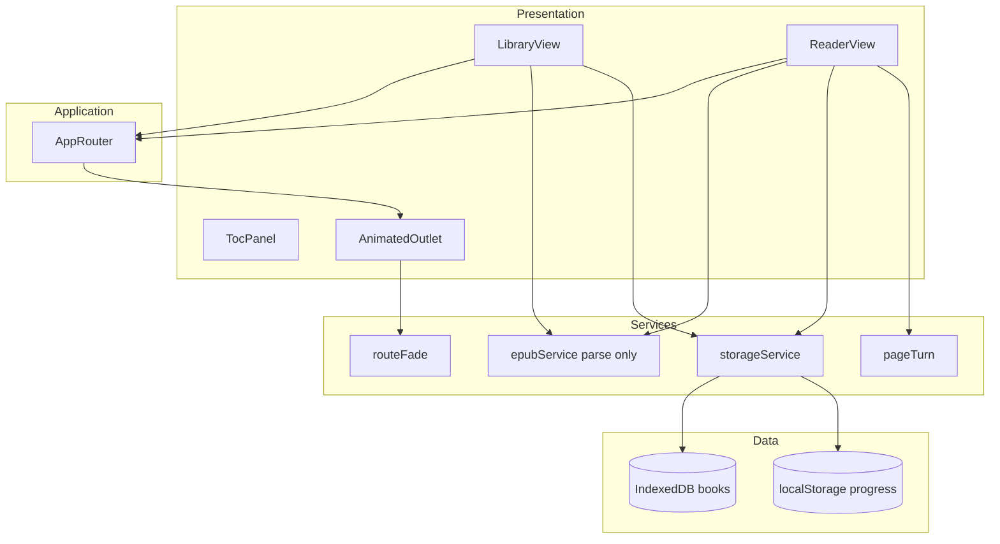
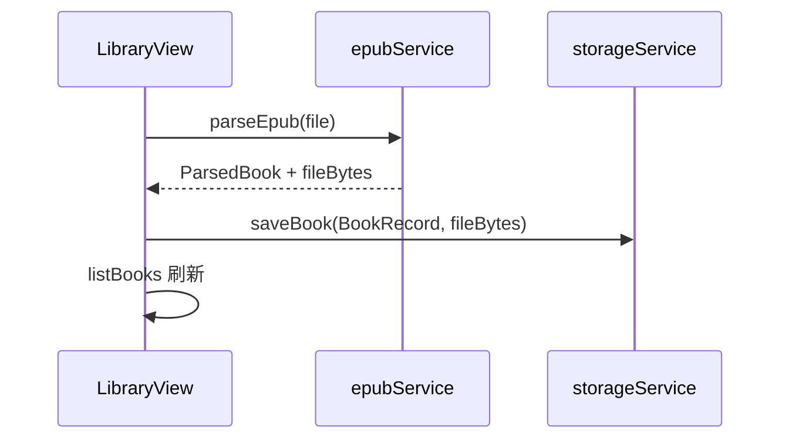
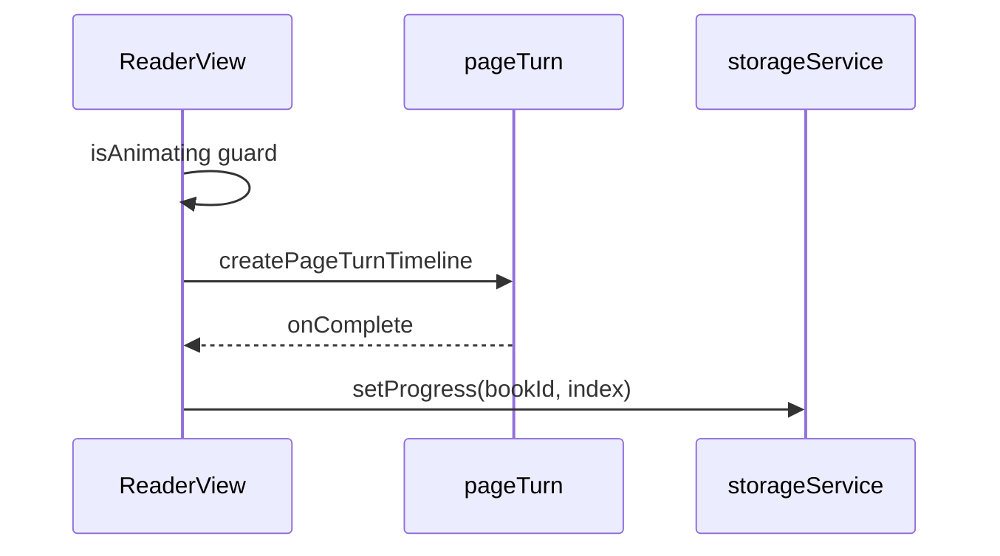

# BookView 设计说明

| 字段 | 值 |
|------|-----|
| 文档版本 | 1.1 |
| 日期 | 2026-05-15 |
| 状态 | 待评审 |
| 需求依据 | [2026-05-15-bookview-requirements.md](./2026-05-15-bookview-requirements.md) |
| 实现任务 | [../plans/2026-05-15-bookview-tasks.md](../plans/2026-05-15-bookview-tasks.md) |

---

## 0. 方案对比（摘要）

| 议题 | 方案 A | 方案 B | 结论 |
|------|--------|--------|------|
| EPUB | `epubjs` | 自研 zip+OPF | **epubjs** — 解析与渲染路径短 |
| 分页 | 真实分页 | 按 spine 段 | **spine 段** — 满足 MVP，实现量小 |
| 动效 | GSAP | CSS only | **GSAP** — 时间轴 + matchMedia |
| 状态 | Zustand | React state + services | **React state + services** — MVP 无跨页复杂共享 |
| 样式 | Tailwind | CSS Modules | **CSS Modules** — 阅读区排版独立、无工具链依赖 |

---

## 1. 设计概述

BookView 为 **SPA**：`LibraryView` 与 `ReaderView` 由 React Router 切换。`epubService` **仅负责解析**；`storageService` **负责** IndexedDB 与进度。阅读器按 spine 段注入 HTML；翻页由 `pageTurn` 时间轴驱动；路由切换由 `routeFade` 处理（FR-A02）。



---

## 2. 技术栈（已定案）

| 层级 | 选型 |
|------|------|
| 框架 | React 18 + TypeScript |
| 构建 | Vite |
| 路由 | React Router v6 |
| EPUB | `epubjs` |
| 动效 | GSAP + `@gsap/react` |
| 存储 | `idb`（书籍）+ `localStorage`（进度） |
| 样式 | **CSS Modules** |
| 状态 | **组件 `useState` + `storageService`** |

---

## 3. 目录结构

```
BookView/
├── docs/specs/、docs/plans/
├── src/
│   ├── app/App.tsx、AnimatedOutlet.tsx
│   ├── features/library/
│   ├── features/reader/
│   ├── services/epub/epubService.ts
│   ├── services/storage/storageService.ts
│   ├── animation/pageTurn.ts、routeFade.ts、constants.ts
│   └── types/book.ts
└── tests/
```

---

## 4. 模块职责

### 4.1 `epubService`（只解析，不写库）

| 函数 | 说明 |
|------|------|
| `parseEpub(file)` | 返回 `ParsedBook`：元数据、`sections`、`coverBlob`、`fileBytes` |
| `loadSectionHtml(fileBytes, sections, index)` | 渲染单段 HTML 字符串 |

```typescript
interface ParsedBook {
  title: string;
  author?: string;
  coverBlob?: Blob;
  sections: SpineSection[];
  fileBytes: ArrayBuffer;
}

interface BookRecord {
  id: string;
  title: string;
  author?: string;
  coverBlob?: Blob;       // 持久化在 IDB
  sections: SpineSection[];
  // coverUrl 仅 UI 层：URL.createObjectURL(coverBlob)，卸载时 revoke
}
```

### 4.2 `storageService`（唯一持久化入口）

| 方法 | 说明 |
|------|------|
| `saveBook(record, fileBytes)` | IDB 写入 |
| `listBooks()` / `getBook(id)` / `deleteBook(id)` | 书库 CRUD；delete 同时 `clearProgress(id)` |
| `getProgress` / `setProgress` / `clearProgress` | localStorage |

### 4.3 `pageTurn`

```typescript
function createPageTurnTimeline(
  layers: { current: HTMLElement; next: HTMLElement },
  direction: 'next' | 'prev',
  reducedMotion: boolean
): gsap.core.Timeline;
```

- 仅动画 `x`、`opacity`；`reducedMotion` → `tl.duration(0)`
- 返回 timeline，调用方在 `eventCallback('onComplete', ...)` 中交换层与写进度

### 4.4 `routeFade`（FR-A02）

```typescript
function fadeRouteIn(
  el: HTMLElement,
  reducedMotion: boolean
): gsap.core.Tween;
```

- `App` 的 `AnimatedOutlet` 在 `location.pathname` 变化时对 outlet 根节点 `fadeRouteIn`
- 时长 `ROUTE_FADE_DURATION = 0.25`，减少动效时为 0

### 4.5 React 集成要点

- `ReaderView`：`useRef` 双层面板；`goNext`/`goPrev` 内调用 `createPageTurnTimeline`，**非**在 `useGSAP` 的 effect 里自动播放（避免与 sectionIndex 依赖冲突）
- `useGSAP` 仅用于注册 `gsap.matchMedia` 与 `scope` 清理
- `isAnimating` 锁至 `onComplete`
- 目录跳转：直接 `setSectionIndex` + `loadSectionHtml`，`reducedMotion` 或统一走 duration(0) 的 timeline

---

## 5. 数据流

### 5.1 导入



### 5.2 翻页



---

## 6. UI 结构

### 6.1 LibraryView

- 导入、空状态、卡片（封面 `coverUrl`、书名、作者）
- 卡片：**阅读**（链接）、**删除**（`deleteBook` + 刷新列表）

### 6.2 ReaderView

- 双面板 `current` / `next`；底栏 `段 i / n`；左右 20% 热区
- 目录跳转：**瞬时**加载目标段 HTML（FR-R02 / S5）

### 6.3 TocPanel

- 侧栏；项点击 → `onJumpToSection(index)`

---

## 7. 路由

| 路径 | 组件 |
|------|------|
| `/` | `LibraryView` |
| `/read/:bookId` | `ReaderView`（无书记录 → `Navigate` 到 `/`） |

`AnimatedOutlet` 包裹 `<Outlet />`，pathname 变化时 `routeFade`。

---

## 8. 错误处理

| 场景 | 处理 |
|------|------|
| 非 EPUB / 损坏 | toast，不调用 `saveBook` |
| `bookId` 无效 | 重定向 `/` |
| 段索引越界 | 重置 0 并 `setProgress` |
| IDB 不可用 | 首屏错误条，禁用导入 |

---

## 9. 测试策略

| 目标 | 文件 |
|------|------|
| 进度读写 | `tests/storageService.test.ts` |
| IDB CRUD（fake-indexeddb） | 同上 |
| `createPageTurnTimeline` | `tests/pageTurn.test.ts` |
| `parseEpub` 元数据 | `tests/epubService.test.ts` + fixture |
| Library 空状态 | `tests/LibraryView.test.tsx` |
| 浏览器兼容 | 任务文档 §浏览器验收清单（手动） |

---

## 10. 安全与隐私

- 无上传；`revokeObjectURL` 于封面 URL 卸载时执行

---

## 11. ADR（定案）

| 决策 | 结论 |
|------|------|
| 解析与存储分离 | `epubService` 不碰 IDB |
| 封面 | IDB 存 `coverBlob`；UI 临时 `coverUrl` |
| 进度 | localStorage，与书籍 delete 联动清除 |
| FR-A02 | 独立 `routeFade.ts` + `AnimatedOutlet` |

---

## 12. 修订记录

| 版本 | 日期 | 说明 |
|------|------|------|
| 1.0 | 2026-05-15 | 初稿 |
| 1.1 | 2026-05-15 | 方案对比；去除 Zustand；解析/存储职责分离；补 routeFade；统一 cover 模型 |
