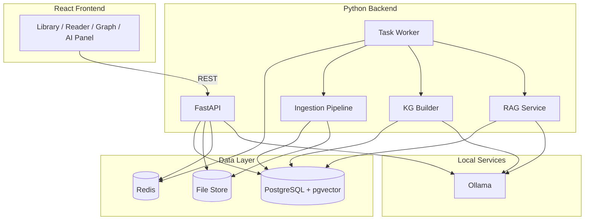
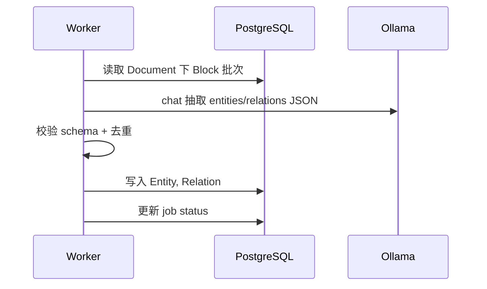

# BookView 平台设计说明（Phase 2）

| 字段 | 值 |
|------|-----|
| 文档版本 | 1.0 |
| 日期 | 2026-05-15 |
| 状态 | 待评审 |
| 需求依据 | [平台需求](./2026-05-15-bookview-platform-requirements.md) |
| 实施任务 | [平台实施计划](../plans/2026-05-15-bookview-platform-tasks.md) |

---

## 0. 方案对比

| 议题 | 方案 A | 方案 B | 结论 |
|------|--------|--------|------|
| 后台框架 | FastAPI | Django | **FastAPI** — 异步友好、OpenAPI 内置 |
| PDF 解析 | PyMuPDF | pdfplumber | **PyMuPDF** — 块 bbox + 文本性能更好 |
| 图谱存储 | Neo4j | PostgreSQL 关系表 + pgvector | **PostgreSQL** — MVP 运维简单；量大再迁 Neo4j |
| 任务队列 | Celery + Redis | ARQ / RQ | **Celery + Redis**（或 Phase 2a 先用 **BackgroundTasks** 简化） |
| 本地模型 | Ollama | llama.cpp 直连 | **Ollama** — 统一 chat/embed API |
| 文件存储 | 本地 `data/` | MinIO | **本地目录** MVP；MinIO 配置可选 |

---

## 1. 总体架构



---

## 2. 技术栈

| 层级 | 选型 |
|------|------|
| API | FastAPI, Uvicorn, Pydantic v2 |
| ORM | SQLAlchemy 2.0, Alembic |
| DB | PostgreSQL 15 + `pgvector` |
| 队列 | Celery + Redis（2a 可 FastAPI `BackgroundTasks` 过渡） |
| PDF | PyMuPDF (`fitz`) |
| EPUB | `ebooklib` + BeautifulSoup4 |
| AI | `httpx` 调 Ollama REST；`langchain` 可选封装 |
| 前端 | 沿用 Phase 1 React + GSAP，新增 API client |

---

## 3. 仓库目录（单仓 Monorepo）

```
BookView/
├── frontend/          # Phase 1 迁入（原 src/）
├── backend/
│   ├── app/
│   │   ├── main.py
│   │   ├── api/       # routes: documents, structure, graph, ai
│   │   ├── models/    # SQLAlchemy
│   │   ├── schemas/   # Pydantic
│   │   ├── services/
│   │   │   ├── ingest_pdf.py
│   │   │   ├── ingest_epub.py
│   │   │   ├── kg_extract.py
│   │   │   └── rag.py
│   │   └── workers/   # Celery tasks
│   ├── alembic/
│   ├── prompts/
│   └── pyproject.toml
├── data/              # gitignore：上传文件
├── docker-compose.yml # postgres, redis, ollama(optional)
└── docs/
```

---

## 4. 文档结构模型（统一 EPUB / PDF）

```mermaid
erDiagram
  Document ||--o{ Section : has
  Section ||--o{ Page : has
  Page ||--o{ Block : has
  Section ||--o{ Block : has
  Block ||--o{ Block : parent
  Document ||--o{ Entity : mentions
  Entity ||--o{ Relation : from
  Entity ||--o{ Relation : to

  Document {
    uuid id PK
    string title
    string format
    string file_path
    string status
  }
  Section {
    uuid id PK
    uuid document_id FK
    string title
    int order_index
    string path
  }
  Page {
    uuid id PK
    uuid section_id FK
    int page_number
  }
  Block {
    uuid id PK
    uuid page_id FK
    uuid section_id FK
    string block_type
    text plain_text
    jsonb bbox
    int order_index
    tsvector search_vector
  }
  Entity {
    uuid id PK
    uuid document_id FK
    string entity_type
    string name
    jsonb properties
  }
  Relation {
    uuid id PK
    uuid document_id FK
    uuid from_entity_id FK
    uuid to_entity_id FK
    string relation_type
    uuid source_block_id FK
    float confidence
  }
```

### 4.1 PDF 解析流程

1. `ingest_pdf`：打开文件 → 遍历页  
2. 每页 `page.get_text("dict")` 提取 span/block，合并为逻辑块  
3. 写入 `Page` + `Block`（`bbox` 归一化 0–1 或像素坐标统一一种）  
4. 自动生成 `Section`（按 PDF outline/bookmarks，无则单章）

### 4.2 EPUB 解析流程

1. `ebooklib` 读 spine → `Section`  
2. 每 html 文件 → BeautifulSoup → 按 `p/h1/h2/...` 切 `Block`  
3. 与 Phase 1 spine 段索引可映射 `order_index`

---

## 5. 知识图谱设计

### 5.1 构建流水线



### 5.2 抽取 Prompt 输出（约定 JSON）

```json
{
  "entities": [
    { "name": "量子力学", "type": "Concept", "block_ids": ["..."] }
  ],
  "relations": [
    { "from": "量子力学", "to": "物理学", "type": "PART_OF", "block_ids": ["..."] }
  ]
}
```

### 5.3 查询 API

- `GET /graph/documents/{id}/subgraph?entity_id=&depth=2`  
- 返回 `{ nodes: [], edges: [] }` 供前端 **react-force-graph** 或 **Cytoscape.js**

---

## 6. 本地 AI（Ollama）

### 6.1 环境变量

| 变量 | 默认 | 说明 |
|------|------|------|
| `OLLAMA_BASE_URL` | `http://127.0.0.1:11434` | Ollama 地址 |
| `OLLAMA_CHAT_MODEL` | `qwen2.5:7b` | 对话/抽取 |
| `OLLAMA_EMBED_MODEL` | `nomic-embed-text` | 向量 |

### 6.2 RAG 流程

1. 用户问题 + `document_id`（可选 `block_ids` 范围）  
2. `embedding(question)` → pgvector 检索 top-k blocks  
3. 拼装 context → `chat` → 返回答案 + `citations[]`  

### 6.3 API 草案

| 方法 | 路径 | 说明 |
|------|------|------|
| POST | `/ai/ask` | `{ document_id, question, block_ids? }` |
| POST | `/ai/summarize` | `{ document_id, section_id? }` |
| POST | `/documents/{id}/build-graph` | 触发图谱任务 |
| GET | `/jobs/{id}` | 任务状态 |

---

## 7. 文档与结构 API 草案

| 方法 | 路径 | 说明 |
|------|------|------|
| POST | `/documents` | 上传文件 |
| GET | `/documents` | 列表 |
| GET | `/documents/{id}` | 元数据 + 状态 |
| GET | `/documents/{id}/structure` | 树形 section/page/block |
| GET | `/documents/{id}/blocks/{block_id}` | 单块内容与 bbox |
| GET | `/documents/{id}/pages/{n}` | PDF 页渲染数据 |
| DELETE | `/documents/{id}` | 删除文档及图谱 |

---

## 8. 部署（本地开发）

`docker-compose.yml` 服务：

- `postgres`（含 pgvector 镜像）  
- `redis`  
- `ollama`（可选 profile `ai`）  

```bash
docker compose up -d postgres redis
docker compose --profile ai up -d ollama
cd backend && uvicorn app.main:app --reload
```

---

## 9. 与 Phase 1 关系

| Phase 1 | Phase 2 演进 |
|---------|----------------|
| IndexedDB 存书 | 改为 API 为主，IDB 可选缓存 |
| 仅 EPUB | EPUB + PDF |
| 无图谱 | 图谱页 + 阅读器联动 |
| 无 AI | 侧栏问答/摘要 |

Phase 1 任务可继续完成作为 **离线演示**；平台任务从 **2a** 起与前端并行。

---

## 10. 修订记录

| 版本 | 日期 | 说明 |
|------|------|------|
| 1.0 | 2026-05-15 | 初稿 |
