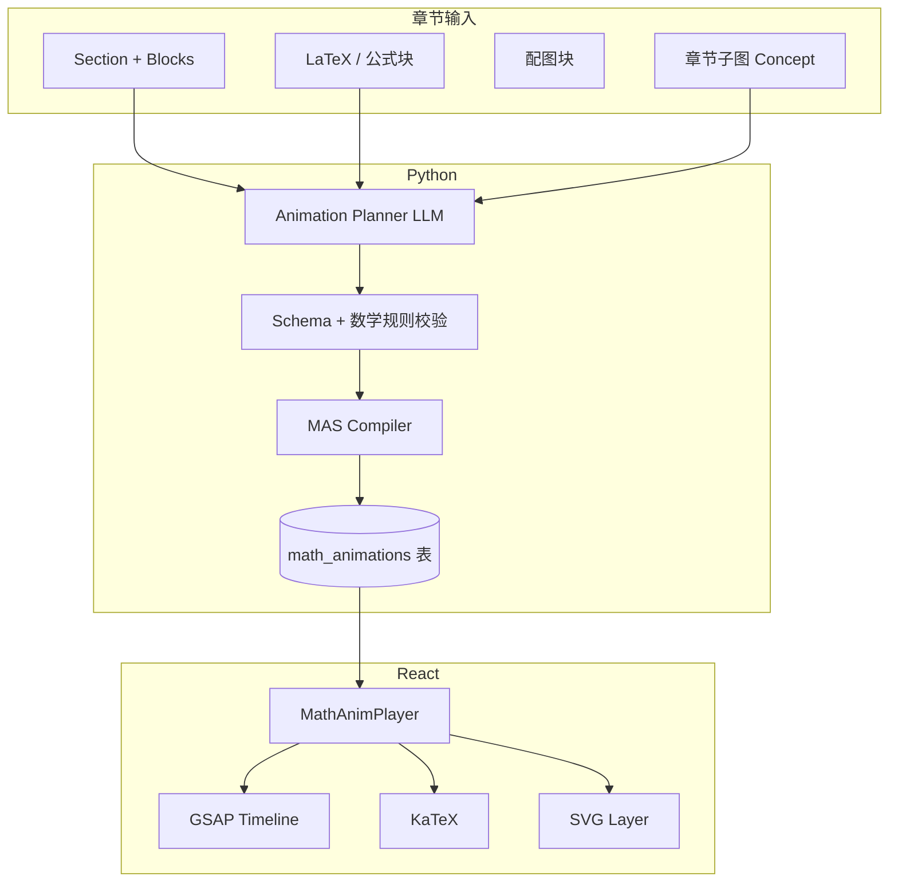
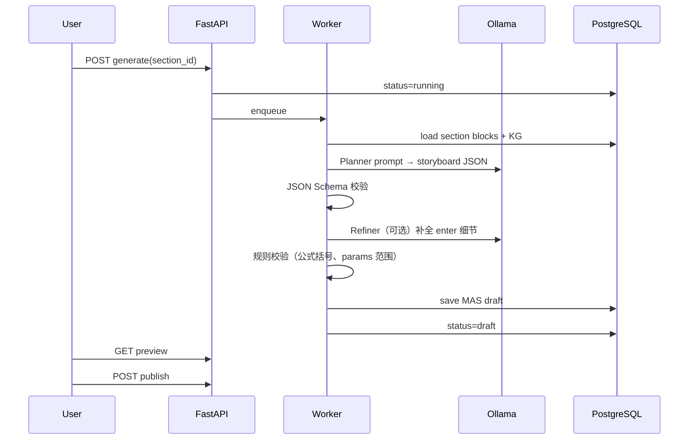

# 数学章节动画生成 — 需求与设计

| 字段 | 值 |
|------|-----|
| 文档版本 | 1.0 |
| 日期 | 2026-05-16 |
| 状态 | 待评审 |
| 依赖 | [平台设计](./2026-05-15-bookview-platform-design.md)、[Phase 1 设计](./2026-05-15-bookview-design.md) |
| 实施计划 | [数学动画任务](../plans/2026-05-16-math-chapter-animation-tasks.md) |

---

## 1. 问题与目标

### 1.1 问题

数学教材某一**章节**往往包含：定义 → 例题 → 推导 → 图形直觉。静态 PDF/EPUB 难以呈现「一步步显现」的过程。需要在 **指定章节（Section）** 上，自动生成可播放、可交互、可复核的教学动画。

### 1.2 目标

| 目标 | 说明 |
|------|------|
| **章节绑定** | 动画与 `document_id + section_id` 一一关联，可版本化 |
| **可生成** | 从章节结构化内容与公式，经本地 AI **规划** + **编译** 为可执行脚本 |
| **可播放** | 前端 GSAP 时间轴驱动，支持暂停/步进/减少动效 |
| **数学可信** | 公式用 LaTeX 渲染；几何/函数图用声明式图元，避免 AI 直接写任意 JS |
| **可编辑** | 生成结果为人可读的 JSON（MAS），支持教师微调后再发布 |

### 1.3 非目标（首期）

- 全自动生成电影级 3D 动画  
- 不校验即发布的「黑盒」可执行代码（禁止 AI 直接输出 `eval` / 任意 TS）  
- 跨章节连续长视频导出（可作为 Phase 2.5）

---

## 2. 用户场景

| ID | 场景 | 输入 | 输出 |
|----|------|------|------|
| M-S1 | 教师选定一章 | 章节「§3.2 二次函数图像」 | 生成动画草稿，预览通过 |
| M-S2 | 学生复习 | 打开已发布动画 | 步进播放推导 |
| M-S3 | 命题不完整 | 章节缺关键定义 | 生成失败 + 提示补全块 |
| M-S4 | 减少动效 | 系统开启无障碍 | 逐步切换无过渡，内容仍分步显示 |
| M-S5 | 与原文对照 | 播放中点击某步 | 高亮对应 `block_id` 原文 |

---

## 3. 方案对比

| 方案 | 做法 | 优点 | 缺点 | 结论 |
|------|------|------|------|------|
| **A. 声明式 MAS + 解释器** | AI 输出 JSON 脚本 → 前端 `MathAnimPlayer` 映射 GSAP | 安全、可审、可版本 diff | 需维护图元库 | **推荐 MVP** |
| B. AI 生成 GSAP/TS 源码 | 直接写组件代码 | 灵活 | 难验证、安全风险、难维护 | 否 |
| C. Manim/视频预渲染 | Python 出 mp4 | 质量高 | 非交互、构建重 | 作导出插件 |
| D. 纯 CSS/关键帧 | 手写动画 | 简单 | 难以从章节自动生成 | 仅作图元内部实现 |

**推荐：A（MAS）+ 可选 C（导出视频）**

---

## 4. 总体架构



**原则：** AI 只产出 **MAS JSON**；浏览器只执行 **白名单图元**；GSAP 只负责时间与缓动。

---

## 5. 章节如何作为生成单元

### 5.1 绑定模型

```typescript
interface MathAnimationRecord {
  id: string;
  documentId: string;
  sectionId: string;          // 数学「一章」
  version: number;            // 同章可多次生成
  status: 'draft' | 'published' | 'failed';
  mas: MathAnimationScript;   // 见 §6
  sourceBlockIds: string[];   // 溯源
  createdAt: string;
}
```

### 5.2 章节内容打包（给 Planner 的上下文）

从平台 `GET /documents/{id}/structure` 取出 `section_id` 下所有 `Block`，组装为：

```json
{
  "section_title": "3.2 二次函数的图像与性质",
  "blocks": [
    { "id": "b1", "type": "heading", "text": "3.2 ..." },
    { "id": "b2", "type": "paragraph", "text": "一般地，函数 y=ax^2+bx+c ..." },
    { "id": "b3", "type": "formula", "latex": "y = ax^2 + bx + c \\quad (a \\neq 0)" },
    { "id": "b4", "type": "figure", "asset_url": "..." }
  ],
  "concepts": ["二次函数", "抛物线", "顶点"],
  "prerequisites": ["一元二次方程"]
}
```

`concepts` / `prerequisites` 来自该章节的 **知识图谱子图**（可选，提高规划质量）。

### 5.3 生成触发

| 方式 | API |
|------|-----|
| 手动 | `POST /documents/{doc}/sections/{sec}/animations/generate` |
| 批量 | `POST /documents/{doc}/animations/generate-all-math`（仅 `subject=math` 元数据） |

---

## 6. MAS — 数学动画脚本（核心 DSL）

### 6.1 顶层结构

```json
{
  "meta": {
    "title": "二次函数图像的构成",
    "duration_estimate_sec": 90,
    "level": "high_school",
    "locale": "zh-CN"
  },
  "scenes": [
    {
      "id": "scene1",
      "title": "从解析式到图像",
      "steps": [ /* Step[] */ ]
    }
  ]
}
```

### 6.2 Step（一步一屏逻辑状态）

每个 `step` 描述 **画布状态** + **进入该状态的动画**：

```json
{
  "id": "step3",
  "narration": "当 a>0 时，抛物线开口向上。",
  "source_blocks": ["b3", "b4"],
  "canvas": {
    "formulas": [
      { "id": "f1", "latex": "y = ax^2 + bx + c", "x": 0.5, "y": 0.15, "highlight": ["a"] }
    ],
    "graph": {
      "type": "function",
      "fn": "a*x^2 + b*x + c",
      "domain": [-5, 5],
      "params": { "a": 1, "b": 0, "c": 0 },
      "show_vertex": true
    },
    "callouts": [
      { "target": "graph.vertex", "text": "顶点" }
    ]
  },
  "enter": {
    "type": "sequence",
    "children": [
      { "op": "reveal", "target": "f1", "effect": "fadeUp" },
      { "op": "draw", "target": "graph", "effect": "strokeDraw", "duration": 0.8 },
      { "op": "emphasize", "target": "f1.a", "effect": "pulse", "duration": 0.4 }
    ]
  }
}
```

### 6.3 白名单图元（`canvas` 层）

| 图元 | 用途 | 渲染 |
|------|------|------|
| `formulas[]` | 公式及高亮片段 | KaTeX |
| `graph.function` | 函数图像 | SVG + 采样 |
| `graph.geometry` | 点线圆、辅助线 | SVG |
| `graph.numberLine` | 不等式、区间 | SVG |
| `table` | 取值表 | HTML |
| `callouts[]` | 标注 | HTML overlay |
| `transform` | 公式变形（等价变换） | 分步替换 LaTeX |

### 6.4 白名单操作（`enter` 层 → GSAP）

| op | 说明 | GSAP 映射 |
|----|------|-----------|
| `reveal` | 显示元素 | `opacity` 0→1, `y` 偏移 |
| `hide` | 隐藏 | 反向 |
| `draw` | 曲线/线段绘制 | `strokeDashoffset` |
| `emphasize` | 高亮项 | `scale` + `color` |
| `morph` | 公式 morph | 两态 LaTeX 交叉淡入或 reserved 分步 |
| `paramTween` | 参数变化 | 更新 `params` + 重绘 graph |
| `sequence` | 子步骤顺序 | `gsap.timeline()` |

**禁止：** 任意 `customScript`、网络请求、DOM 选择器由 AI 指定。

---

## 7. 生成流水线（后端 Python）



### 7.1 Planner Prompt 要点（Ollama）

- 输入：§5.2 章节包 + **动画模板示例**（few-shot）  
- 输出：仅 JSON，符合 MAS Schema  
- 约束：3–7 个 `steps`；每步必须 `source_blocks`；复杂推导拆步  
- 数学：不编造定理；若原文无证明，用 `narration` 标注「见课本」

### 7.2 校验层

| 校验 | 说明 |
|------|------|
| JSON Schema | `backend/schemas/mas-v1.json` |
| 引用块存在 | `source_blocks ⊆ section.blocks` |
| LaTeX 可渲染 | KaTeX 预检（后端 `pylatexenc` 或调用前端 wasm 服务） |
| 函数安全 | `fn` 仅允许 `x` 与参数符号，表达式 AST 白名单 |
| 时长上限 | 总 `duration_estimate_sec ≤ 300` |

### 7.3 与知识图谱联动

- 章节的 `Concept` 节点 → Planner 用于确定 **讲解顺序**（先修在前）  
- 动画中 `callouts` 可链接 `entity_id`，播放时侧边展示图谱入口（FR 扩展）

---

## 8. 前端播放设计（MathAnimPlayer）

### 8.1 组件结构

```
MathAnimPlayer/
├── SceneTabs          # 多 scene 切换
├── Stage (SVG+HTML)   # 公式层 + 图形层
├── Transport          # 播放/暂停/上一步/下一步
├── NarrationBar       # 旁白（可选 TTS 后续）
└── SourcePeek         # 对照 source block 原文
```

### 8.2 GSAP 集成

- 每个 `step` 切换 → `timeline.clear()` → 根据 `enter` 编译为 GSAP  
- `prefers-reduced-motion`：`duration: 0`，仅切换 `canvas` 状态  
- 与阅读器关系：全屏 overlay 或 `/read/:bookId/section/:sec/anim` 独立路由  

### 8.3 参数动画示例（`a` 从 1 变到 -1）

```typescript
// 解释器伪代码
function playParamTween(step: Step, op: ParamTweenOp) {
  const tl = gsap.timeline();
  tl.to(state.params, {
    [op.param]: op.to,
    duration: op.duration,
    ease: 'power2.inOut',
    onUpdate: () => redrawGraph(state.canvas.graph),
  });
  return tl;
}
```

---

## 9. 数据表（扩展平台 DB）

```sql
-- 数学章节动画
CREATE TABLE math_animations (
  id UUID PRIMARY KEY,
  document_id UUID NOT NULL REFERENCES documents(id),
  section_id UUID NOT NULL REFERENCES sections(id),
  version INT NOT NULL DEFAULT 1,
  status VARCHAR(20) NOT NULL,
  mas JSONB NOT NULL,
  source_block_ids UUID[] NOT NULL,
  error_message TEXT,
  created_at TIMESTAMPTZ DEFAULT now(),
  UNIQUE (section_id, version)
);
```

---

## 10. API 草案

| 方法 | 路径 | 说明 |
|------|------|------|
| POST | `/documents/{d}/sections/{s}/animations/generate` | 异步生成，返回 `job_id` |
| GET | `/documents/{d}/sections/{s}/animations` | 列表（含 draft/published） |
| GET | `/animations/{id}` | 获取 MAS JSON |
| PATCH | `/animations/{id}` | 教师编辑 MAS 后保存 |
| POST | `/animations/{id}/publish` | 发布给学生端 |
| GET | `/animations/{id}/preview` | 草稿预览 token |

---

## 11. 质量与人工复核

| 环节 | 机制 |
|------|------|
| 生成后 | 默认 **draft**，教师预览逐步 |
| 发布前 | 可选「校验清单」：公式与课本一致、步骤数、无空白 scene |
| 学生端 | 仅 `published` |
| 失败 | `failed` + `error_message`（如 LaTeX 无效、章节无公式块） |

---

## 12. 分阶段交付

| 阶段 | 能力 |
|------|------|
| **M1** | MAS Schema + 前端 Player（手写 1 个例题脚本） |
| **M2** | 后端 Planner + 生成 API；`formulas` + `graph.function` |
| **M3** | `geometry`、`paramTween`、block 对照 |
| **M4** | KG 排序 + 导出 MP4（Manim 可选） |

---

## 13. 修订记录

| 版本 | 日期 | 说明 |
|------|------|------|
| 1.0 | 2026-05-16 | 初稿：MAS DSL、章节绑定、生成与播放架构 |
