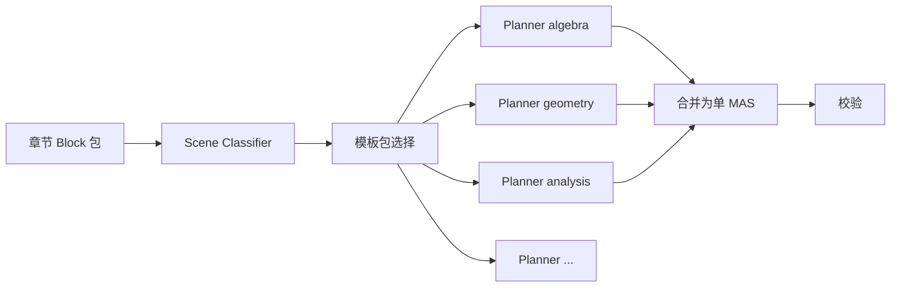
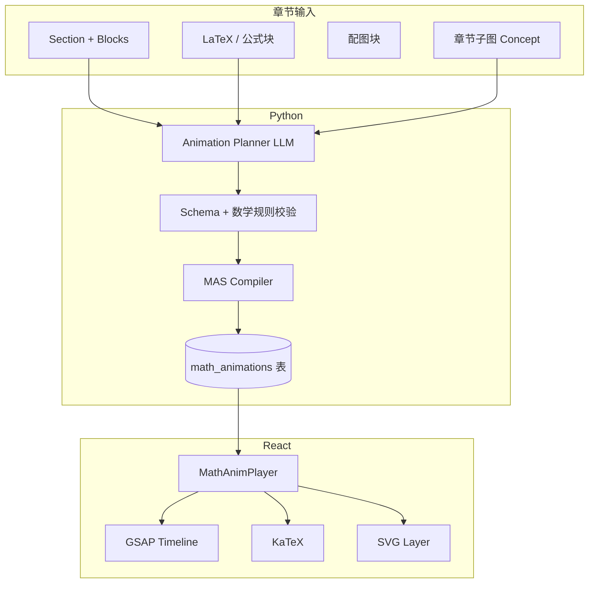
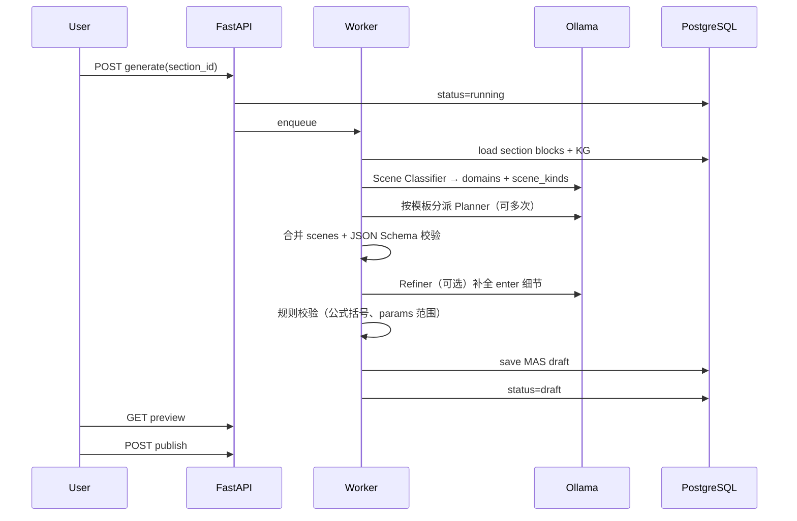

# 数学章节动画生成 — 需求与设计

| 字段 | 值 |
|------|-----|
| 文档版本 | 1.2 |
| 日期 | 2026-05-16 |
| 状态 | 待评审 |
| 范围 | **全场景**（中小学代数 / 几何证明 / 大学分析 / 线代 / 概率统计 / 离散） |
| 依赖 | [平台设计](./2026-05-15-bookview-platform-design.md)、[Phase 1 设计](./2026-05-15-bookview-design.md) |
| 实施计划 | [数学动画任务](../plans/2026-05-16-math-chapter-animation-tasks.md) |

---

## 1. 问题与目标

### 1.1 问题

数学教材某一**章节**往往包含：定义 → 例题 → 推导 → 图形直觉。静态 PDF/EPUB 难以呈现「一步步显现」的过程。需要在 **指定章节（Section）** 上，自动生成可播放、可交互、可复核的教学动画。

### 1.2 目标

| 目标 | 说明 |
|------|------|
| **章节绑定** | 动画与 `document_id + section_id` 一一关联，可版本化 |
| **可生成** | 从章节结构化内容与公式，经本地 AI **规划** + **编译** 为可执行脚本 |
| **可播放** | 前端 GSAP 时间轴驱动，支持暂停/步进/减少动效 |
| **数学可信** | 公式用 LaTeX 渲染；几何/函数图用声明式图元，避免 AI 直接写任意 JS |
| **可编辑** | 生成结果为人可读的 JSON（MAS），支持教师微调后再发布 |
| **全场景** | 同一套 MAS + Player；按章节**自动识别领域**并选用模板包，而非只做单一课型 |

### 1.3 非目标（首期）

- 全自动生成电影级 3D 动画  
- 不校验即发布的「黑盒」可执行代码（禁止 AI 直接输出 `eval` / 任意 TS）  
- 跨章节连续长视频导出（可作为 Phase 2.5）

---

## 2. 用户场景

| ID | 场景 | 输入 | 输出 |
|----|------|------|------|
| M-S1 | 教师选定一章 | 章节「§3.2 二次函数图像」 | 生成动画草稿，预览通过 |
| M-S2 | 学生复习 | 打开已发布动画 | 步进播放推导 |
| M-S3 | 命题不完整 | 章节缺关键定义 | 生成失败 + 提示补全块 |
| M-S4 | 减少动效 | 系统开启无障碍 | 逐步切换无过渡，内容仍分步显示 |
| M-S5 | 与原文对照 | 播放中点击某步 | 高亮对应 `block_id` 原文 |
| M-S6 | 一章多题型 | 「定义+例题+证明」混合章节 | 多 `scene`，按模板切换 |
| M-S7 | 大学 ε-δ 证明 | 分析学章节 | `proof` 模板分步展示条件与结论 |
| M-S8 | 概率分布 | 统计章节 | 直方图/曲线 + 公式联动 |

---

## 3. 全场景分类体系

### 3.1 领域（`meta.domains[]`）

| 代码 | 名称 | 典型章节内容 | 主要图元 |
|------|------|--------------|----------|
| `algebra` | 代数 | 函数、方程、不等式、恒等变形 | `function`, `numberLine`, `transform` |
| `geometry` | 几何 | 全等/similar、辅助线、作图 | `geometry`, `geometry.proof` |
| `analysis` | 分析 | 极限、连续、导数、积分、级数 | `function`, `limitviz`, `integral.area` |
| `linear_algebra` | 线代 | 向量、矩阵、线性变换 | `vector`, `matrix`, `transform2d` |
| `probability` | 概率统计 | 分布、期望、假设检验示意 | `chart`, `distribution` |
| `discrete` | 离散 | 数列、归纳法、组合计数 | `sequence`, `induction` |
| `generic` | 通用 | 定义+定理+例题，无明确图形 | `formulas`, `transform`, `table` |

一章可含 **多个 domain**（如先定义后几何证明），Planner 输出多个 `scene`。

### 3.2 学段（`meta.level`）

| 值 | 说明 | 步数建议 | 旁白风格 |
|----|------|----------|----------|
| `middle_school` | 初中 | 4–6 步/场景 | 直观、少符号堆叠 |
| `high_school` | 高中 | 5–8 步 | 高考导向，强调关键变形 |
| `undergraduate` | 大学 | 6–12 步 | 允许 ε-δ、严格 quantifiers |
| `mixed` | 混合/教辅 | 按分类器 | 自动适配 |

### 3.3 场景模板（`meta.scene_kind`）

每种 `scene_kind` 对应 **固定 step 骨架**（Planner 填内容，不发明结构）：

| scene_kind | 适用领域 | 典型 step 骨架 |
|------------|----------|----------------|
| `definition_intuition` | 全领域 | 引入 → 定义式 reveal → 直观图/例 → 小结 |
| `worked_example` | algebra, analysis | 题意 → 变形1 → 变形2 → 结论 → 检验 |
| `graph_exploration` | algebra, analysis | 作图 → 参数扫描 → 特征点标注 |
| `geometry_proof` | geometry | 已知标示 → 辅助线 → 全等/相似 → 结论 |
| `construction` | geometry | 尺规作图序列（圆/弧/垂线） |
| `limit_proof` | analysis | 目标式 → ε-δ 结构 → 放缩 → 结论 |
| `derivative_tangent` | analysis | 割线 → 极限式 → 切线动画 |
| `integral_riemann` | analysis | 分割 → 矩形和 → 取极限 → 面积 |
| `vector_operation` | linear_algebra | 向量作图 → 运算 → 结果向量 |
| `matrix_linear_map` | linear_algebra | 单位格 → 变换 → 特征方向（可选） |
| `distribution_demo` | probability | PMF/PDF → 参数变化 → 数字特征 |
| `induction` | discrete | 基础步 → 归纳假设 → 归纳步 |
| `fallback_generic` | generic | 按 block 顺序 reveal，无专用图 |

### 3.4 全场景生成路由



- **Classifier**（轻量 LLM 或规则）：输出 `{ domains, level, scenes: [{ scene_kind, block_ids }] }`  
- 每个 `(scene_kind, blocks)` 调用对应 **few-shot 模板**（`backend/prompts/math/{scene_kind}.txt`）  
- 合并为同一 MAS 的多个 `scenes[]`，Player 用 SceneTabs 切换  

---

## 4. 方案对比

| 方案 | 做法 | 优点 | 缺点 | 结论 |
|------|------|------|------|------|
| **A. 声明式 MAS + 解释器** | AI 输出 JSON 脚本 → 前端 `MathAnimPlayer` 映射 GSAP | 安全、可审、可版本 diff | 需维护图元库 | **推荐 MVP** |
| B. AI 生成 GSAP/TS 源码 | 直接写组件代码 | 灵活 | 难验证、安全风险、难维护 | 否 |
| C. Manim/视频预渲染 | Python 出 mp4 | 质量高 | 非交互、构建重 | 作导出插件 |
| D. 纯 CSS/关键帧 | 手写动画 | 简单 | 难以从章节自动生成 | 仅作图元内部实现 |

**推荐：A（MAS）+ 可选 C（导出视频）**

---

## 5. 总体架构



**原则：** AI 只产出 **MAS JSON**；浏览器只执行 **白名单图元**；GSAP 只负责时间与缓动。

---

## 6. 章节如何作为生成单元

### 6.1 绑定模型

```typescript
interface MathAnimationRecord {
  id: string;
  documentId: string;
  sectionId: string;          // 数学「一章」
  version: number;            // 同章可多次生成
  status: 'draft' | 'published' | 'failed';
  mas: MathAnimationScript;   // 见 §6
  sourceBlockIds: string[];   // 溯源
  createdAt: string;
}
```

### 6.2 章节内容打包（给 Planner 的上下文）

从平台 `GET /documents/{id}/structure` 取出 `section_id` 下所有 `Block`，组装为：

```json
{
  "section_title": "3.2 二次函数的图像与性质",
  "blocks": [
    { "id": "b1", "type": "heading", "text": "3.2 ..." },
    { "id": "b2", "type": "paragraph", "text": "一般地，函数 y=ax^2+bx+c ..." },
    { "id": "b3", "type": "formula", "latex": "y = ax^2 + bx + c \\quad (a \\neq 0)" },
    { "id": "b4", "type": "figure", "asset_url": "..." }
  ],
  "concepts": ["二次函数", "抛物线", "顶点"],
  "prerequisites": ["一元二次方程"],
  "detected": {
    "domains": ["algebra"],
    "level": "high_school",
    "scenes": [
      { "scene_kind": "definition_intuition", "block_ids": ["b1", "b2", "b3"] },
      { "scene_kind": "graph_exploration", "block_ids": ["b3", "b4"] }
    ]
  }
}
```

`concepts` / `prerequisites` 来自该章节的 **知识图谱子图**（可选）。`detected` 由 **Scene Classifier** 写入，供全场景 Planner 分派模板。

### 6.3 生成触发

| 方式 | API |
|------|-----|
| 手动 | `POST /documents/{doc}/sections/{sec}/animations/generate` |
| 批量 | `POST /documents/{doc}/animations/generate-all-math`（仅 `subject=math` 元数据） |

---

## 7. MAS — 数学动画脚本（核心 DSL）

### 7.1 顶层结构

```json
{
  "meta": {
    "title": "二次函数图像的构成",
    "duration_estimate_sec": 90,
    "level": "high_school",
    "locale": "zh-CN",
    "domains": ["algebra"],
    "scene_profile": "single",
    "mas_version": "1.1"
  },
  "scenes": [
    {
      "id": "scene1",
      "scene_kind": "graph_exploration",
      "domain": "algebra",
      "title": "从解析式到图像",
      "steps": [ /* Step[] */ ]
    }
  ]
}
```

### 7.2 Step（一步一屏逻辑状态）

每个 `step` 描述 **画布状态** + **进入该状态的动画**：

```json
{
  "id": "step3",
  "narration": "当 a>0 时，抛物线开口向上。",
  "source_blocks": ["b3", "b4"],
  "canvas": {
    "formulas": [
      { "id": "f1", "latex": "y = ax^2 + bx + c", "x": 0.5, "y": 0.15, "highlight": ["a"] }
    ],
    "graph": {
      "type": "function",
      "fn": "a*x^2 + b*x + c",
      "domain": [-5, 5],
      "params": { "a": 1, "b": 0, "c": 0 },
      "show_vertex": true
    },
    "callouts": [
      { "target": "graph.vertex", "text": "顶点" }
    ]
  },
  "enter": {
    "type": "sequence",
    "children": [
      { "op": "reveal", "target": "f1", "effect": "fadeUp" },
      { "op": "draw", "target": "graph", "effect": "strokeDraw", "duration": 0.8 },
      { "op": "emphasize", "target": "f1.a", "effect": "pulse", "duration": 0.4 }
    ]
  }
}
```

### 7.3 白名单图元（`canvas` 层，全场景）

| 图元 | 领域 | 用途 | 渲染 |
|------|------|------|------|
| `formulas[]` | 全 | 公式及高亮 | KaTeX |
| `transform` | 全 | 等价变形链 | 分步 LaTeX |
| `table` | algebra, discrete | 取值表、递推表 | HTML |
| `graph.function` | algebra, analysis | \(y=f(x)\)、参数曲线 | SVG |
| `graph.numberLine` | algebra | 不等式解集 | SVG |
| `graph.geometry` | geometry | 点、线段、圆、角、多边形 | SVG |
| `geometry.proof` | geometry | 已知/求证结构、标记角相等 | SVG overlay |
| `geometry.construction` | geometry | 尺规步骤列表 | SVG 顺序 draw |
| `limitviz` | analysis | ε-δ 带、趋近箭头 | SVG + formulas |
| `integral.area` | analysis | 黎曼和、曲边梯形填充 | SVG |
| `vector[]` | linear_algebra | 平面向量箭头 | SVG |
| `matrix` | linear_algebra | 矩阵排版、高亮行列 | HTML/KaTeX |
| `transform2d` | linear_algebra | 线性变换作用于网格 | SVG |
| `chart.histogram` | probability | 直方图 | SVG |
| `chart.bar` | probability | 条形图 | SVG |
| `distribution` | probability | 正态/二项等曲线 | SVG + params |
| `sequence` | discrete | 数列项、通项 | formulas + table |
| `induction` | discrete | 归纳框：基础/假设/递推 | HTML 结构 |
| `callouts[]` | 全 | 标注、角标 | HTML |
| `figure.ref` | 全 | 引用课本配图块 | `` + bbox |

**互斥建议（单 step 内）：** 避免同时开 3 个以上重型图元；Classifier 按 `scene_kind` 限制可用图元子集。

### 7.4 白名单操作（`enter` 层 → GSAP）

| op | 说明 | GSAP 映射 |
|----|------|-----------|
| `reveal` | 显示元素 | `opacity` 0→1, `y` 偏移 |
| `hide` | 隐藏 | 反向 |
| `draw` | 曲线/线段绘制 | `strokeDashoffset` |
| `emphasize` | 高亮项 | `scale` + `color` |
| `morph` | 公式 morph | 两态 LaTeX 交叉淡入或 reserved 分步 |
| `paramTween` | 参数变化 | 更新 `params` + 重绘 graph |
| `sequence` | 子步骤顺序 | `gsap.timeline()` |
| `mark` | 几何/mark 状态 | 角相等 tick、边相等 tick |
| `construct` | 尺规一步 | 圆/弧/垂线 `draw` 子路径 |
| `partition` | 积分分割 | 矩形条 `reveal` 逐列 |
| `inductionStep` | 归纳模板 | 高亮当前证明框 |

**禁止：** 任意 `customScript`、网络请求、DOM 选择器由 AI 指定。

### 7.5 全场景 Step 示例（几何证明）

```json
{
  "id": "gp2",
  "scene_kind": "geometry_proof",
  "narration": "连接 BD，由 SAS 得 △ABD ≌ △CBD。",
  "source_blocks": ["b12"],
  "canvas": {
    "geometry": {
      "points": { "A": [0,0], "B": [4,0], "C": [2,3], "D": [2,0] },
      "segments": [["A","B"], ["B","C"], ["C","A"], ["B","D"]],
      "marks": { "equal_segments": [["AB","CB"]] }
    },
    "geometry.proof": { "given": ["AB=CB", "∠ABD=∠CBD"], "prove": "AD=CD" }
  },
  "enter": {
    "type": "sequence",
    "children": [
      { "op": "draw", "target": "segment.BD", "effect": "strokeDraw" },
      { "op": "mark", "target": "triangles.ABD,CBD", "effect": "congruentFlash" }
    ]
  }
}
```

### 7.6 全场景 Step 示例（ε-δ 极限）

```json
{
  "id": "lim3",
  "scene_kind": "limit_proof",
  "narration": "对任意 ε>0，取 δ=ε/3，当 0<|x-a|<δ 时……",
  "canvas": {
    "formulas": [
      { "id": "lim", "latex": "\\lim_{x \\to a} f(x) = L" },
      { "id": "eps", "latex": "\\forall \\varepsilon > 0,\\ \\exists \\delta > 0" }
    ],
    "limitviz": {
      "a": 1, "L": 2,
      "epsilon_band": true,
      "delta_band": true,
      "fn": "x^2 + 1"
    }
  },
  "enter": { "type": "sequence", "children": [
    { "op": "reveal", "target": "lim" },
    { "op": "reveal", "target": "limitviz.epsilon_band" },
    { "op": "paramTween", "target": "limitviz.delta", "param": "delta", "to": 0.33 }
  ]}
}
```

---

## 8. 生成流水线（后端 Python）



### 8.1 Scene Classifier（全场景入口）

- 输入：§6.2 章节包  
- 输出：`detected.scenes[]`（每项含 `scene_kind`, `domain`, `block_ids`）  
- 实现：`prompts/math/classifier.txt`；规则兜底（标题含「证明」→ `geometry_proof`）  
- 一章多场景时 `meta.scene_profile = "multi"`

### 8.2 分模板 Planner（few-shot 库）

| 目录 | 覆盖 scene_kind |
|------|-----------------|
| `prompts/math/algebra/` | `worked_example`, `graph_exploration`, `definition_intuition` |
| `prompts/math/geometry/` | `geometry_proof`, `construction` |
| `prompts/math/analysis/` | `limit_proof`, `derivative_tangent`, `integral_riemann` |
| `prompts/math/linear_algebra/` | `vector_operation`, `matrix_linear_map` |
| `prompts/math/probability/` | `distribution_demo` |
| `prompts/math/discrete/` | `induction`, `sequence` |
| `prompts/math/generic/` | `fallback_generic` |

每个模板文件包含：**step 骨架** + 1 个完整 MAS 样例。Planner 只填 `latex`、坐标、`params`、旁白，不改骨架。

### 8.3 校验层（全场景）

| 校验 | 说明 |
|------|------|
| JSON Schema | `shared/schemas/mas-v1.1.json` |
| scene_kind 合法 | 枚举 13 种 + `fallback_generic` |
| 图元与 scene_kind 匹配 | 如 `geometry_proof` 禁止仅用 `distribution` |
| 引用块存在 | `source_blocks ⊆ section.blocks` |
| LaTeX | KaTeX 预检 |
| 表达式安全 | `fn` / `params` AST 白名单 |
| 几何坐标有界 | 点坐标归一化 0–1 或 -10–10 |
| 时长 | 单 scene ≤ 180s，整章 ≤ 600s |

### 8.4 与知识图谱联动

- `Concept` 定讲解顺序；`prerequisites` 插入复习 scene（可选）  
- 实体边 `RELATED_TO` 可在播放侧栏跳转  
- 多 domain 章节：KG 聚类辅助 Classifier

---

## 9. 前端播放设计（MathAnimPlayer）

### 9.1 组件结构

```
MathAnimPlayer/
├── SceneTabs              # 多 scene（全场景一章多段）
├── LayerRegistry          # 按 domain 注册渲染器
│   ├── FormulaLayer
│   ├── FunctionGraphLayer
│   ├── GeometryLayer
│   ├── LimitLayer
│   ├── IntegralLayer
│   ├── VectorMatrixLayer
│   ├── ChartDistributionLayer
│   └── InductionLayer
├── Interpreter (masInterpreter.ts)
├── Transport
├── NarrationBar
└── SourcePeek
```

`LayerRegistry` 根据 `canvas` 中出现的键自动挂载层；未知键降级为 `formulas` + `callouts`。

### 9.2 GSAP 集成

- 每个 `step` 切换 → `timeline.clear()` → 根据 `enter` 编译为 GSAP  
- `prefers-reduced-motion`：`duration: 0`，仅切换 `canvas` 状态  
- 与阅读器关系：全屏 overlay 或 `/read/:bookId/section/:sec/anim` 独立路由  

### 9.3 参数动画示例（`a` 从 1 变到 -1）

```typescript
// 解释器伪代码
function playParamTween(step: Step, op: ParamTweenOp) {
  const tl = gsap.timeline();
  tl.to(state.params, {
    [op.param]: op.to,
    duration: op.duration,
    ease: 'power2.inOut',
    onUpdate: () => redrawGraph(state.canvas.graph),
  });
  return tl;
}
```

---

## 10. 数据表（扩展平台 DB）

```sql
-- 数学章节动画
CREATE TABLE math_animations (
  id UUID PRIMARY KEY,
  document_id UUID NOT NULL REFERENCES documents(id),
  section_id UUID NOT NULL REFERENCES sections(id),
  version INT NOT NULL DEFAULT 1,
  status VARCHAR(20) NOT NULL,
  mas JSONB NOT NULL,
  source_block_ids UUID[] NOT NULL,
  error_message TEXT,
  created_at TIMESTAMPTZ DEFAULT now(),
  UNIQUE (section_id, version)
);
```

---

## 11. API 草案

| 方法 | 路径 | 说明 |
|------|------|------|
| POST | `/documents/{d}/sections/{s}/animations/generate` | 异步生成，返回 `job_id` |
| GET | `/documents/{d}/sections/{s}/animations` | 列表（含 draft/published） |
| GET | `/animations/{id}` | 获取 MAS JSON |
| PATCH | `/animations/{id}` | 教师编辑 MAS 后保存 |
| POST | `/animations/{id}/publish` | 发布给学生端 |
| GET | `/animations/{id}/preview` | 草稿预览 token |

---

## 12. 质量与人工复核

| 环节 | 机制 |
|------|------|
| 生成后 | 默认 **draft**，教师预览逐步 |
| 发布前 | 可选「校验清单」：公式与课本一致、步骤数、无空白 scene |
| 学生端 | 仅 `published` |
| 失败 | `failed` + `error_message`（如 LaTeX 无效、章节无公式块） |

---

## 13. 全场景分阶段交付

| 阶段 | 范围 | 交付物 |
|------|------|--------|
| **M1 内核** | 全场景共用 | MAS 1.1 Schema、`LayerRegistry` 骨架、`Interpreter`、手写 3 个样例（代数/几何/分析各 1） |
| **M2 代数+通用** | algebra, generic | Classifier v1、`graph.function`、`transform`、生成 API |
| **M3 几何** | geometry | `geometry`、`geometry.proof`、`construction`、`mark` |
| **M4 分析** | analysis | `limitviz`、`integral.area`、`derivative_tangent` 模板 |
| **M5 线代+概率+离散** | linear_algebra, probability, discrete | `vector`、`matrix`、`distribution`、`induction` |
| **M6 生产化** | 全场景 | KG 排序、教师编辑台、Manim 导出、全场景回归测试集 |

**样例库（`samples/mas/`）：** 每个 `scene_kind` 至少 1 个权威手写 JSON，作为 Planner few-shot 与回归金标准。

---

## 14. 开源库选型（按功能 + 直观动效）

> **原则：** 数学语义用 **领域库** 画对；「一步步动起来」用 **GSAP** 统一编排；公式一律 **KaTeX**。不采用「AI 直接写动画代码」。

### 14.1 总栈（定案）

| 层级 | 选型 | 作用 |
|------|------|------|
| 编排 | **GSAP** + `@gsap/react` | 步进、缓动、描边绘制、`paramTween`、减少动效 |
| 公式 | **KaTeX** | 所有 `formulas[]`、`matrix` 排版 |
| 函数/分析直观 | **Mafs** | 坐标系、函数曲线、动点、向量、黎曼和示意 |
| 几何直观 | **JSXGraph** | 点线圆、辅助线、角标注、尺规作图序列 |
| 统计图 | **D3**（或 D3 子模块） | 直方图、分布曲线、参数变化 |
| 公式排版输入（教师编辑） | **MathLive**（可选） | 编辑 MAS 内 LaTeX |
| 视频导出（可选） | **Manim Community**（Python） | 高质量讲解片，非交互主路径 |

**不采用为主路径：** MathJax（过重）、Desmos API（非开源）、纯自研 SVG 函数引擎（维护成本高）、manim-web（尚早，作观察）。

### 14.2 按 `scene_kind` → 库 + 直观动效手段

| scene_kind | 主库 | GSAP 动效（直观关键） |
|------------|------|------------------------|
| `definition_intuition` | KaTeX + Mafs/JSXGraph 其一 | 公式 `fadeUp`；定义后 **延迟 0.3s** 再出图 |
| `worked_example` | KaTeX | 每步 `transform` 高亮变化项；旧式划掉 `opacity` + 新式 `reveal` |
| `graph_exploration` | **Mafs** `Plot.OfX` + `useMovablePoint` | **`paramTween`** 扫 `a,b,c`；顶点/零点 **emphasize** 脉冲 |
| `geometry_proof` | **JSXGraph** | 辅助线 `strokeDraw`；角/边相等 **`mark`** 闪烁；全等三角形 **fill** 淡入 |
| `construction` | **JSXGraph** | 圆/弧/垂线逐步 `construct`（dashoffset）；尺规步骤与旁白同步 |
| `limit_proof` | **Mafs** + KaTeX | ε、δ 带 **`paramTween` 带宽**；趋近点沿曲线 **motionPath** |
| `derivative_tangent` | **Mafs** | 割线绕点旋转 → `paramTween` 使 Δx→0，切线 **`draw`** |
| `integral_riemann` | **Mafs**（黎曼矩形）或 SVG 条 | **`partition`** 矩形条依次 `reveal`；上限 n 增加 `paramTween` |
| `vector_operation` | **Mafs** `Vector` | 向量平移 **`paramTween`**；平行四边形法则分步 `sequence` |
| `matrix_linear_map` | **Mafs** 网格变形 + KaTeX 矩阵 | 单位正方形格子 **`transform2d`**（GSAP matrix 插值） |
| `distribution_demo` | **D3** 曲线/柱 | μ、σ **`paramTween`** 曲线形变；面积归一化过渡 |
| `induction` | KaTeX + HTML 框 | 三步框 **`inductionStep`** 高亮切换 |
| `fallback_generic` | KaTeX | 按 block 顺序 `reveal`，无图时保持节奏感 |

### 14.3 按 MAS 图元 → 实现层

| MAS 图元 | 实现 |
|----------|------|
| `formulas[]` | KaTeX；`highlight` 用 CSS 背景 + GSAP `emphasize` |
| `transform` | 两步 LaTeX 交叉 `morph`（opacity 切换，避免复杂 LaTeX morph） |
| `graph.function` | Mafs `Plot.OfX` / `Plot.Parametric` |
| `graph.numberLine` | Mafs `MovablePoint` on 数轴或轻量 SVG |
| `graph.geometry` | JSXGraph `board.create('point'|'segment'|'circle',...)` |
| `geometry.proof` | JSXGraph + HTML 侧栏 given/prove |
| `limitviz` | Mafs 不等式带 + 动点 |
| `integral.area` | Mafs 黎曼组件或 D3 area |
| `vector[]` | Mafs `Vector` |
| `matrix` | KaTeX `bmatrix` |
| `transform2d` | Mafs 点阵经 2×2 矩阵变换（GSAP 插值矩阵元素） |
| `chart.*` / `distribution` | D3 `line` / `rect` |
| `sequence` / `induction` | React 组件 + GSAP |

### 14.4 「直观」统一规范（动效预设）

所有场景共享 **BookView Motion Presets**（`animation/presets.ts`），避免每页观感杂乱：

| 预设 | GSAP 参数 | 用于 |
|------|-----------|------|
| `fadeUp` | `y: 12→0, opacity: 0→1, 0.45s power2.out` | 公式、说明 |
| `strokeDraw` | `strokeDashoffset` 动画 | 线、圆、曲线 |
| `pulse` | `scale 1→1.05→1` | 强调项、顶点 |
| `paramSmooth` | `0.8s power2.inOut` | 参数变化 |
| `stepPause` | 步间 `0.25s` 空白 | 认知缓冲 |

`prefers-reduced-motion`：预设时长置 0，保留分步换屏。

### 14.5 与 MAS 解释器集成方式

```
MathAnimPlayer
  → masInterpreter (enter ops → GSAP timeline)
  → LayerRegistry
       ├── FormulaLayer      → KaTeX
       ├── MafsLayer         → 函数/极限/积分/向量
       ├── JSXGraphLayer     → 几何/作图
       ├── D3ChartLayer      → 概率统计
       └── GenericHtmlLayer  → 归纳框、表格
```

每个 Layer 暴露：`mount(canvasState)`、`applyOp(op)`、`seek(stepIndex)`，供 Interpreter 统一调度。

### 14.6 后端（生成侧）配套

| 功能 | 库 | 说明 |
|------|-----|------|
| LaTeX 校验 | `pylatexenc` 或调用前端 KaTeX WASM | 生成后校验 |
| 视频导出 | **Manim** | `POST /animations/{id}/export-mp4`，与 MAS 并行，非替代 Player |
| 几何坐标粗算 | `sympy`（可选） | 辅助 Classifier 判断图形类型 |

### 14.7 依赖清单（frontend/package.json 目标）

```json
{
  "gsap": "^3.12",
  "@gsap/react": "^2.1",
  "katex": "^0.16",
  "mafs": "^0.21",
  "jsxgraph": "^1.12",
  "d3": "^7.9"
}
```

---

## 15. 修订记录

| 版本 | 日期 | 说明 |
|------|------|------|
| 1.0 | 2026-05-16 | 初稿 |
| 1.1 | 2026-05-16 | 全场景 |
| 1.2 | 2026-05-16 | §14 开源库选型：KaTeX + Mafs + JSXGraph + D3 + GSAP |
